  

  

---

## Open to collaboration

  
  

#### 🛠️ Infrastructure & Tools

  
  
  

#### ⚙️ Backend & Systems

  
  
  
  

#### 🌐 Frontend Development

  
  
  
  

### 🏆 Achievement

  

---

### 📊 System Diagnostics

  <table border="0">
    <tr>
      <td colspan="2" align="center">
        
      </td>
    </tr>
    <tr>
      <td width="50%" align="center">
        
      </td>
      <td width="50%" align="center">
        
      </td>
    </tr>
  </table>

  

